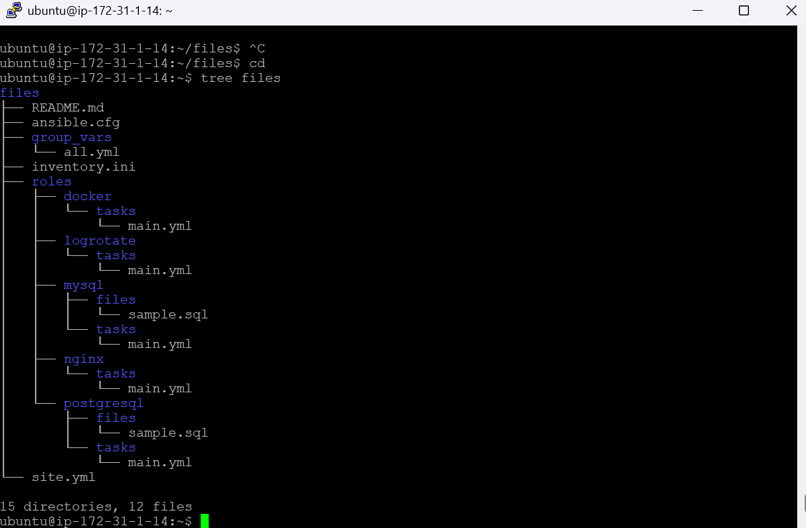

## Ansible Infrastructure Setup on Ubuntu VM

**This project demonstrates how to use Ansible as a configuration management tool to install and configure Nginx, MySQL, PostgreSQL, and Docker Swarm on a remote Ubuntu VM.
It also covers database user creation, seeding sample data, log locations, and log rotation configuration and testing.**

## These are my file structures

1. Using inventory.ini file to verify the ssh connection between the controller and worker.

      ansible -i inventory.ini workers -m ping

3. Here, I created a site.yml file to what are the steps neet to perform orderly

      - hosts: workers
        become: yes
        roles:
          - nginx
          - mysql
          - postgresql
          - docker
          - logrotate

   [image](./4.png)
   
   [image](./3.png)

   4. Using ansible-playnook command to perform the created file to install
  
            ansible-playbook site.yml

   5. I created a logrotate another file to store the logs for mysql and postgresql. We can see the logs at /var/logs

            ls /etc/logrotate.d/
            [mysql]
            cat /etc/logrotate.d/mysql-server
            [postgresql]
            cat /etc/logrotate.d/postgresql-common
   

   
